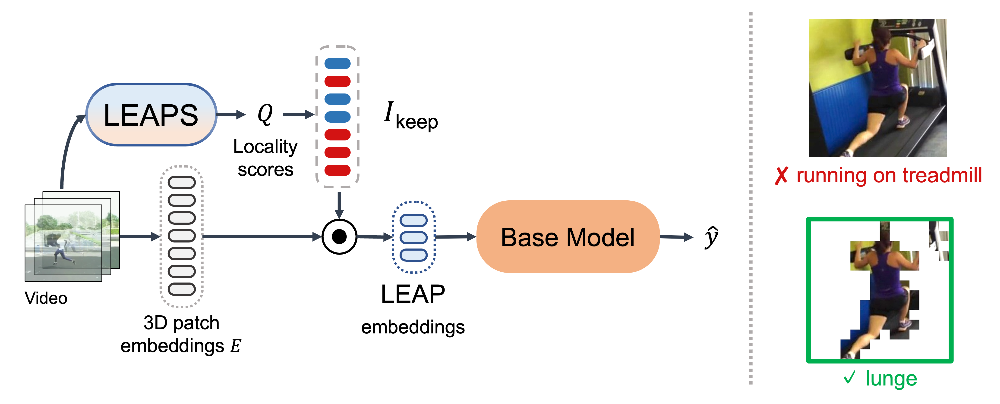

# LEAPS: Low-Entropy Action-aware Patch Selection for Background-Bias Mitigation in Efficient Video Recognition



## Visualization

Use `visualize.py` to visualize the selected patches by LEAPS.


- `--visualize_videos_src` : the directory containing the source videos for visualization
- `--visualize_videos_dest` : the directory where the visualized videos will be saved

```bash
python visualize.py \
    -leaps_r 0.25 \
    --visualize_videos_src ./visualize_videos/src \
    --visualize_videos_dest ./visualize_videos/dest
```

## Inference

Use `inference.py` to perform inference with LEAPS.

- `-m` : choice from `leaps_videomae` and `leaps_vivit`
- `-cls_model` : the pretrained classification model (base model) from huggingface, e.g., `MCG-NJU/videomae-base-finetuned-kinetics`
- `-leaps_r` : the ratio of patches to be selected by LEAPS
- `-td` : the directory containing the training data in WebDataset format
- `-vd` : the directory containing the validation data in WebDataset format
- `--devices` : the number of devices (GPUs) to use for inference

```bash
python inference.py \
    -m leaps_videomae \
    -cls_model MCG-NJU/videomae-base-finetuned-kinetics \
    -leaps_r 0.5 \
    -td data/wds/k400/k400_train_allframe \
    -vd data/wds/k400/wds_k400_val_allframe \
    --devices 1 \
    -fs 8
```

### Dataset format

This codebase uses WebDataset format for training and validation data.
WebDataset format is [here](data/README.md).

But if you use only visualize.py, you can directly use the original mp4 files as input.

## Distillation

Use `distill.py` to perform distillation with LEAPS.

- `-teacher_model` : the pretrained teacher model from huggingface, e.g., `MCG-NJU/videomae-large`
- `-s_xxx`: the hyperparameters for the student model, including hidden dimension (`s_hdim`), feedforward dimension (`s_fdim`), number of layers (`s_layer`), number of heads (`s_head`)

```bash
python distill.py \
    --teacher_model MCG-NJU/videomae-large \
    -s_hdim 128 \
    -s_fdim 512 \
    -s_layer 6 \
    -s_head 4 \
    -fs 16 \
    --clips_per_video 1 \
    -td data/wds/k400/k400_train_allframe \
    -vd data/wds/k400/wds_k400_val_allframe \
```

## Model Weight

Distilled LEAPS weight is [here](pth/leaps).
